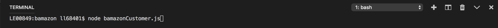
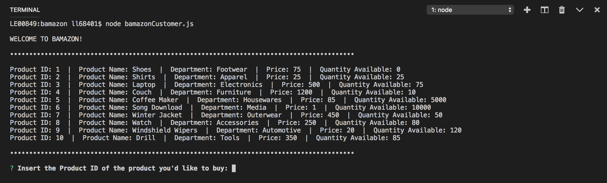
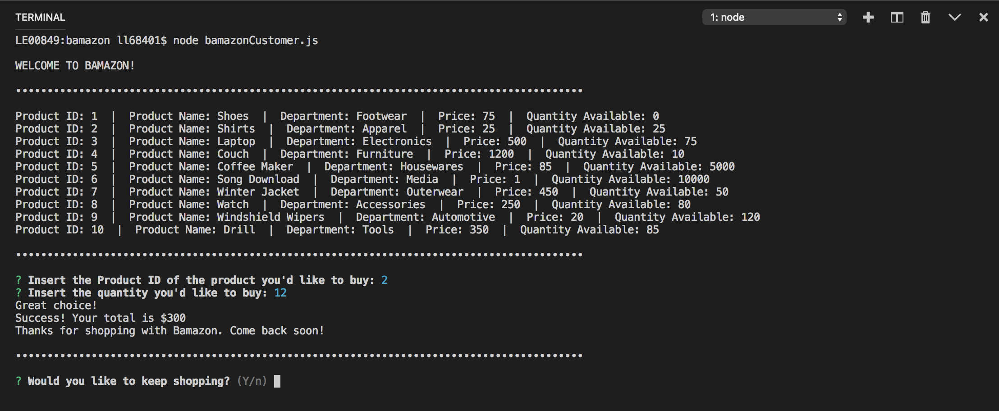
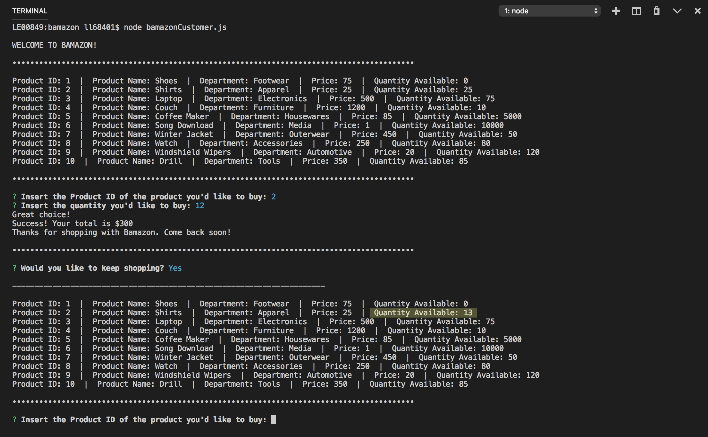
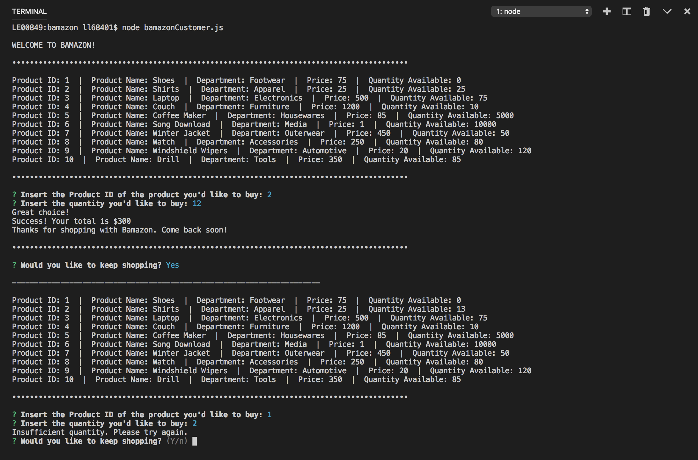
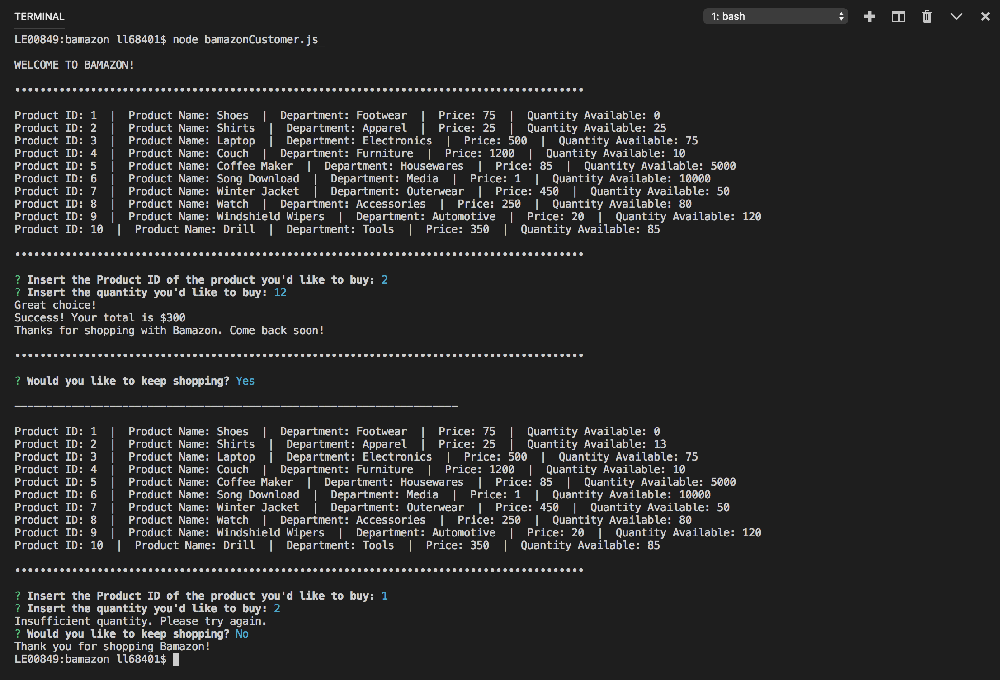

# Welcome to my Bamazon Node App

## Getting Started
In order to use this app:
* Clone repo to your machine
* Be sure to `npm install` all dependencies:
    * https://www.npmjs.com/package/mysql
    * https://www.npmjs.com/package/inquirer
* Using MySQL Workbench or the appropriat eextension,create a MySQL database called "bamazonDB" — populate it with content from **bamazon.sql**
* Start using the app by running the following in the Terminal command line: `node bamazonCustomer.js`
* Follow the prompts
* Enjoy!

-----

## Demo

1. Launch the app. 

2. You'll be presented with a welcome message, a list of items available, and a prompt to choose a product by inserting its ID. 

3. Once a Product ID has been inserted, you'll be asked to insert the quantity. If there is enough of that item in stock, your order will be placed and your total will be displayed. You'll also receive a prompt asking if you would like to continue shopping. 

4. If you say yes, you will be presented with the list of items again, this time with updated quantities. Insert the ID for the next product you'd like to buy. 

5. If you select an item that is out of stock or has a lesser quantity than requested, you will receive an Insufficient Quantity error and be prompted to try again. ]

6. If you're all shopped out, simply choose 'n' (for No) and the app connection will end. 